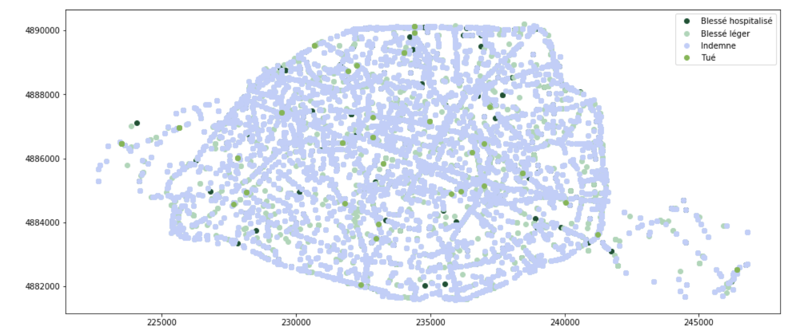
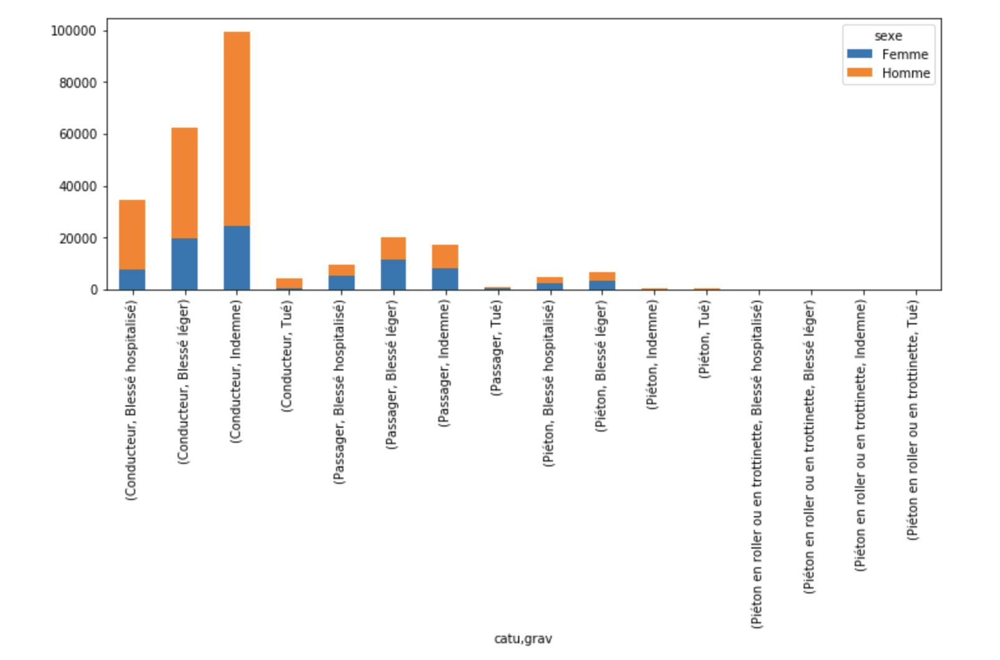
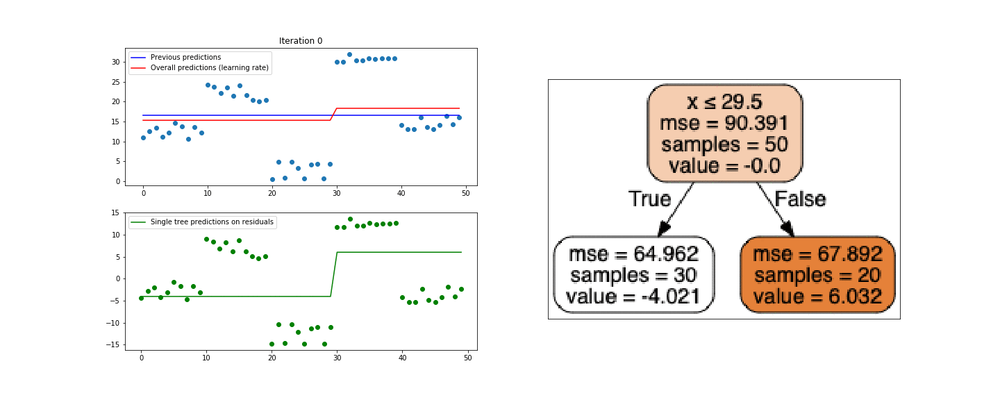

© Luc Bertin - TDs ESILV Python - 2019

# Description

TDs d'enseignement dispensés aux élèves de l'école d'ingénieurs ESILV - Paris La Défense, en initation pour la data analyse avec Python.

<!--  -->

  

  

# Terms & Conditions
©Luc Bertin

The above copyright notice and this permission notice shall be included in all copies or substantial portions of the Software.

THE SOFTWARE IS PROVIDED "AS IS", WITHOUT WARRANTY OF ANY KIND, EXPRESS OR IMPLIED, INCLUDING BUT NOT LIMITED TO THE WARRANTIES OF MERCHANTABILITY, FITNESS FOR A PARTICULAR PURPOSE AND NONINFRINGEMENT. IN NO EVENT SHALL THE X CONSORTIUM BE LIABLE FOR ANY CLAIM, DAMAGES OR OTHER LIABILITY, WHETHER IN AN ACTION OF CONTRACT, TORT OR OTHERWISE, ARISING FROM, OUT OF OR IN CONNECTION WITH THE SOFTWARE OR THE USE OR OTHER DEALINGS IN THE SOFTWARE.

Except as contained in this notice, the name of the X Consortium shall not be used in advertising or otherwise to promote the sale, use or other dealings in this Software without prior written authorization from the X Consortium.
